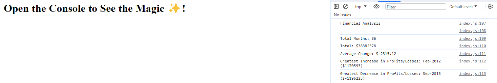

# Console Finances

My solution to the Module 4 challenge for the edX front-end bootcamp. It's a simple calculator that works from pre-defined data and gives some brief analysis.

## Usage
Simply open `index.html` in a web browser, or with the Live Server extension for Visual Studio Code.